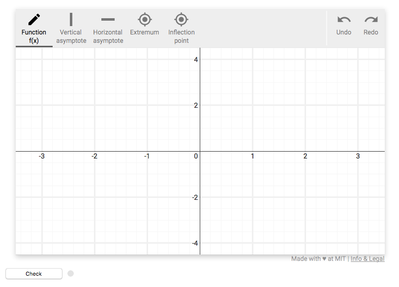
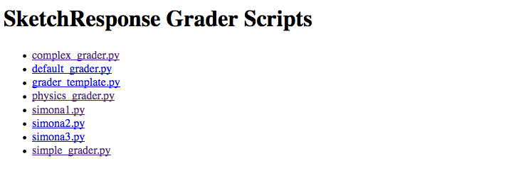

# How To Test Your Grading Scripts Locally

The SketchResponse tool is designed to be used as a web application so when it is properly installed the Sketch Tool and Grader Lib will be hosted on a server somewhere. However, while you are designing and implementing a grading script for a particular problem, it is very convenient to be able to test it on a locally running version of the SketchResponse tool. This allows you to get immediate feedback on how well your grading script works without having to upload anything to your server.

## Flask

The local testing server is implemented using [Flask](http://flask.pocoo.org/). If you do not have flask you will need to install it, which is easily done by running the command. *If you are in Windows make sure you are running the Git Bash shell as Administrator.*

```sh
$ pip install -r requirements.txt
```

## Running the server

### Building the sketch tool distribution

Before you can run the local server, you need to build a local copy of the sketch tool. If you
have already done this and you have not modified the sketch tool in the interim you can skip
this step. Otherwise, follow the instructions [here](sketch_tool_dev_usage.md) or [here](getting_started.md) for details on building the sketch tool distribution.

### Start the grader local server

To run the local server, make sure the grading script you are testing is in the `grading_scripts` directory. Then run the following command from the repository root directory. *If you are in Windows you may need to run the Git Bash shell as Administrator to interact with the local server.*

```sh
$ python server.py
```

You should see a message telling you that the server is running on `http://localhost:5000`.

## Testing your script

Open your web browser of choice and put the following in the url bar, where <grader script name> is the filename of your grader script (leaving the .py extension off):

```sh
http://localhost:5000/<grader script name>
```

You will now see a locally running copy of the SketchResponse Sketch Tool using the configuration options you defined in your grading script. You can use it to draw test input for your grader script and press the 'Check' button in the bottom left corner to run your grader on the functions you have drawn.



If you want to see a listing of the grading scripts in your `grading_scripts` directory, you can leave off the script name. To launch a script from the listing, you can just click on the link for the script you want.

```sh
http://localhost:5000
```

